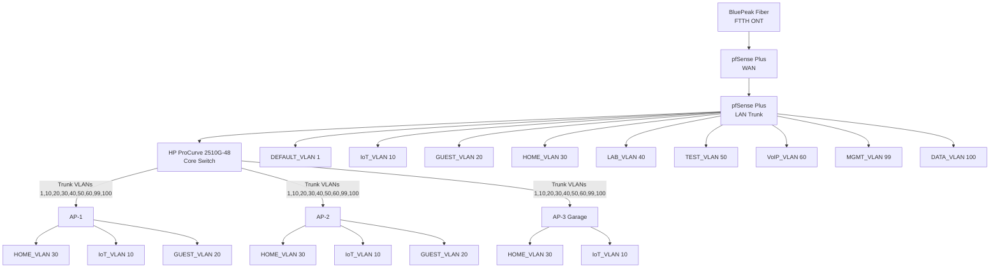

# Network Topology

```mermaid
graph TD
  ISP["BluePeak Fiber<br/>FTTH ONT"] --> WAN["pfSense Plus<br/>WAN"]

  WAN --> PF["pfSense Plus<br/>LAN Trunk"]

  PF --> SW["HP ProCurve 2510G-48<br/>Core Switch"]

  %% VLAN Trunks
  SW -->|Trunk VLANs 1,10,20,30,40,50,60,99,100| AP1[AP-1]
  SW -->|Trunk VLANs 1,10,20,30,40,50,60,99,100| AP2[AP-2]
  SW -->|Trunk VLANs 1,10,20,30,40,50,60,99,100| AP3[AP-3 Garage]

  %% Wireless Networks
  AP1 --> HOME1["HOME_VLAN 30"]
  AP1 --> IOT1["IoT_VLAN 10"]
  AP1 --> GUEST1["GUEST_VLAN 20"]

  AP2 --> HOME2["HOME_VLAN 30"]
  AP2 --> IOT2["IoT_VLAN 10"]
  AP2 --> GUEST2["GUEST_VLAN 20"]

  AP3 --> HOME3["HOME_VLAN 30"]
  AP3 --> IOT3["IoT_VLAN 10"]

  %% Core VLAN Routing
  PF --> V1["DEFAULT_VLAN 1"]
  PF --> V10["IoT_VLAN 10"]
  PF --> V20["GUEST_VLAN 20"]
  PF --> V30["HOME_VLAN 30"]
  PF --> V40["LAB_VLAN 40"]
  PF --> V50["TEST_VLAN 50"]
  PF --> V60["VoIP_VLAN 60"]
  PF --> V99["MGMT_VLAN 99"]
  PF --> V100["DATA_VLAN 100"]
```
