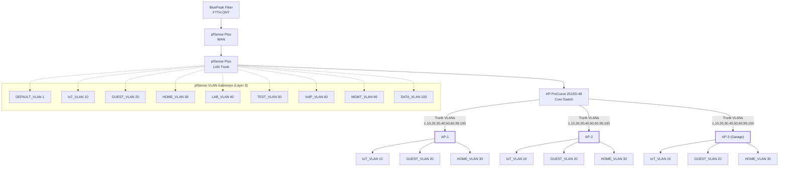

# Network Topology

```mermaid
graph TD
  %% =========================
  %% Physical Topology (Layer 1/2)
  %% =========================
  ISP["BluePeak Fiber<br/>FTTH ONT"]
  PF_WAN["pfSense Plus<br/>WAN"]
  PF_LAN["pfSense Plus<br/>LAN Trunk"]
  SW["HP ProCurve 2510G-48<br/>Core Switch"]

  ISP --> PF_WAN
  PF_WAN --> PF_LAN
  PF_LAN --> SW

  SW -->|Trunk VLANs<br/>1,10,20,30,40,50,60,99,100| AP1["AP-1"]
  SW -->|Trunk VLANs<br/>1,10,20,30,40,50,60,99,100| AP2["AP-2"]
  SW -->|Trunk VLANs<br/>1,10,20,30,40,50,60,99,100| AP3["AP-3 (Garage)"]

  %% =========================
  %% Wireless Access (per AP)
  %% =========================
  AP1 --> IOT1["IoT_VLAN 10"]
  AP1 --> GUEST1["GUEST_VLAN 20"]
  AP1 --> HOME1["HOME_VLAN 30"]

  AP2 --> IOT2["IoT_VLAN 10"]
  AP2 --> GUEST2["GUEST_VLAN 20"]
  AP2 --> HOME2["HOME_VLAN 30"]

  AP3 --> IOT3["IoT_VLAN 10"]
  AP3 --> GUEST3["GUEST_VLAN 20"]
  AP3 --> HOME3["HOME_VLAN 30"]

  %% =========================
  %% Logical Routing (Layer 3)
  %% =========================
  subgraph "pfSense VLAN Gateways (Layer 3)"
    V1["DEFAULT_VLAN 1"]
    V10["IoT_VLAN 10"]
    V20["GUEST_VLAN 20"]
    V30["HOME_VLAN 30"]
    V40["LAB_VLAN 40"]
    V50["TEST_VLAN 50"]
    V60["VoIP_VLAN 60"]
    V99["MGMT_VLAN 99"]
    V100["DATA_VLAN 100"]
  end

  PF_LAN -.-> V1
  PF_LAN -.-> V10
  PF_LAN -.-> V20
  PF_LAN -.-> V30
  PF_LAN -.-> V40
  PF_LAN -.-> V50
  PF_LAN -.-> V60
  PF_LAN -.-> V99
  PF_LAN -.-> V100

classDef trunk stroke-width:3px;
class AP1,AP2,AP3 trunk;
```